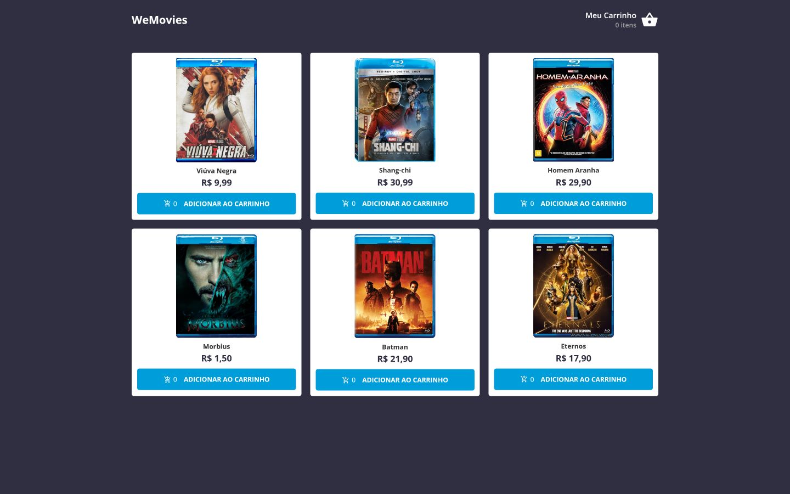

# WeFit Front-end Test

This is a solution to the [WeFit](https://wefit.com.br) Front-end Test

## Table of contents

- [Overview](#overview)
  - [The challenge](#the-challenge)
  - [Screenshot](#screenshot)
  - [Links](#links)
- [My process](#my-process)
  - [Built with](#built-with)
  - [Useful resources](#useful-resources)
- [Author](#author)

## Overview

### The challenge

Users should be able to:

- Home: Onde ele terá que fazer uma requisição na API, trazendo assim, a lista de filmes quem podem ser adicionados ao carrinho.
- Carrinho: Onde ele poderá ver os itens que foram adicionados, somando o valor total com base em cada item adicionado, podendo remover um item do carrinho. Por padrão, se o carrinho tiver nenhum item adicionado, deverá aparecer a tela de empty com a opção de voltar para tela inicial.
- Compra realizada: Após confirmar o pedido na tela anterior, o usuário deverá ser encaminhado para a tela de pedido confirmado. Aqui o usuário também terá a opção de voltar para tela inicial.

### Screenshot




### Links

- Live Site URL: [https://wefit-frontend-test-viniciuscosta89.vercel.app/](https://wefit-frontend-test-viniciuscosta89.vercel.app/)

## My process

### Built with

- Semantic HTML5 markup
- CSS custom properties
- Flexbox
- CSS Grid
- Mobile-first workflow
- [pnpm](https://pnpm.io) - Fast, disk space efficient package manager
- [React](https://react.dev) - JS library
- [React Router](https://reactrouter.com/) - Declarative routing for React
- [Vite](https://vitejs.dev) - Frontend Tooling
- [TanStack Query](https://tanstack.com/query/latest/docs/react/overview) - Powerful asynchronous state management
- [Typescript](https://www.typescriptlang.org) - JavaScript with syntax for types
- [styled-components](https://styled-components.com) - CSS-in-JS
- [Axios](https://axios-http.com/) - Promise based HTTP client for the browser and node.js
- [Framer Motion](https://www.framer.com/motion/) - A production-ready motion library for React

### Useful resources

- Documentations from React, TanStack Query, styled-components, Vite, Axios, Framer Motion and React Router.

## Author

- GitHub - [https://github.com/viniciuscosta89](https://github.com/viniciuscosta89)
- Frontend Mentor - [@viniciuscosta89](https://www.frontendmentor.io/profile/viniciuscosta89)

## Project Setup

```sh
pnpm install
```

### Compile and Hot-Reload for Development

```sh
pnpm dev
```

### Type-Check, Compile and Minify for Production

```sh
npm build
```
